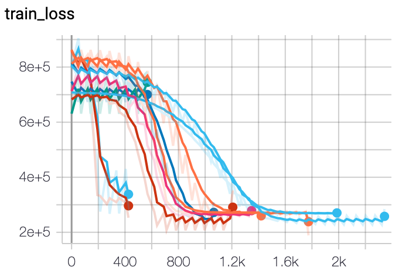

## Deep Learning with combined Image and Tabular data

Building on [Markus Rosen's example](https://github.com/MarkusRosen/pytorch_multi_input_example), who did all the work
of creating the dataset and setup. To simplify experiments with this type of combined data I added some small
improvements:
 
1. Automatically pull the dataset by running `bash get_data.sh`
2. Use pretrained Resnet50 model for image part of network
3. Requirements and unnecessary code pared down